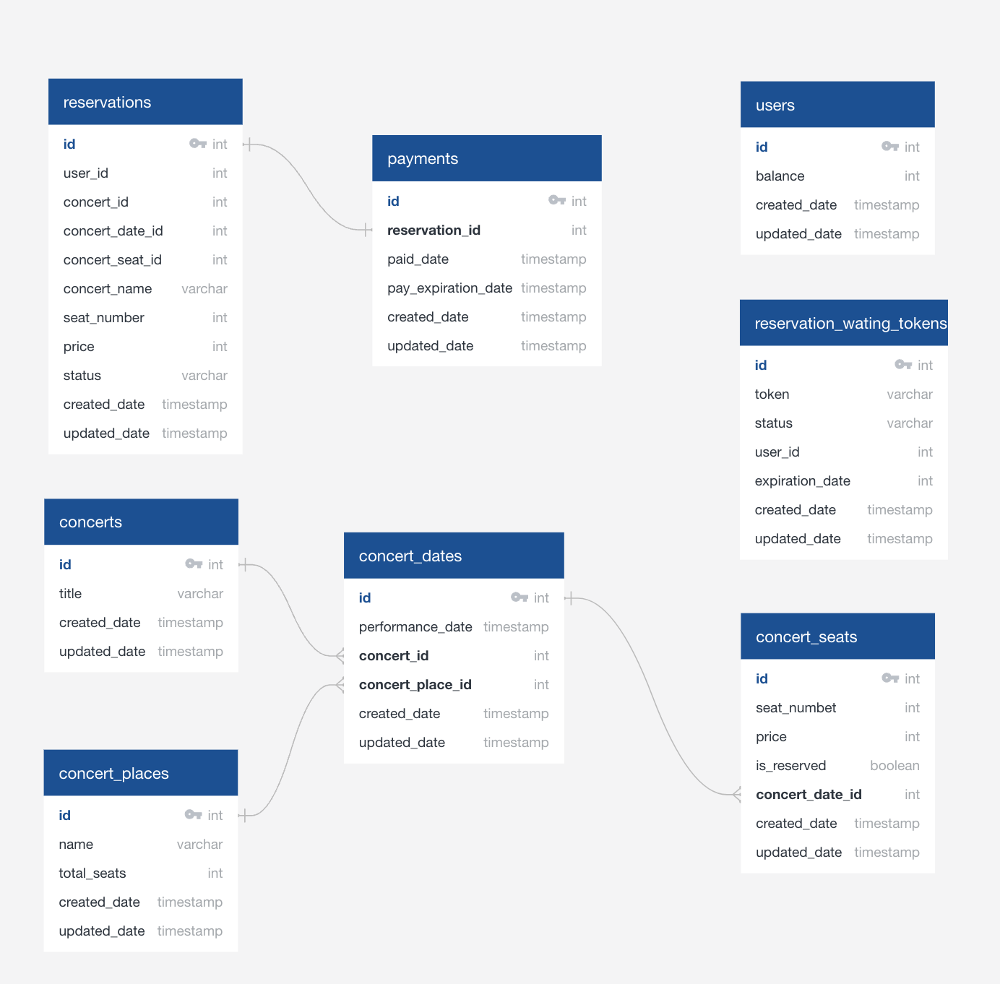
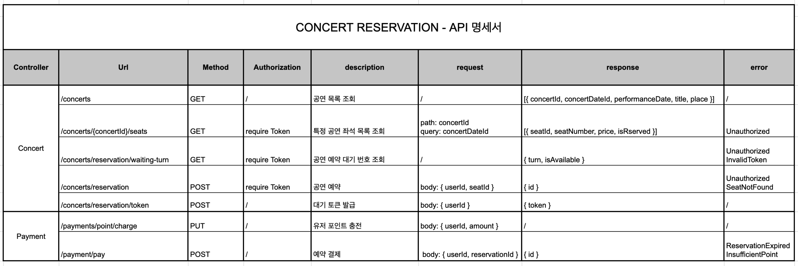

# 항해 플러스 - 공연 예약 서비스

--- 

# 1. ERD


# 2. API - DOCS


# 3. 기술 스택
- Springboot
- JPA
- PostgreSQL
- Swagger

# 4. 패키지 구조

```bash
├── application
│   ├── concert
│   │   ├── dto
│   │   └── ConcertService
│   ├── payment
│   │   ├── dto
│   │   └── PaymentService
├── domain
│   ├── concert
│   │   ├── Concert
│   │   ├── ConcertDate
│   │   ├── ConcertPlace
│   │   ├── ConcertSeat
│   │   ├── ConcertRepository
│   │   ├── ConcertDateRepository
│   │   ├── ConcertPlaceRepository
│   │   └── ConcertSeatRepository
│   ├── payment
│   │   ├── Payment
│   │   └── PaymentRepository
│   ├── user
│   │   ├── User
│   │   └── UserRepository
│   ├── reservation
│   │   ├── Rservation
│   │   ├── ReservationWaitingToken
│   │   ├── RservationRepository
│   │   └── ReservationWaitingTokenRepository
├── interfaces
│   ├── api
│   │   ├── common
│   │   │   ├── dto
│   │   ├── concert
│   │   │   ├── dto
│   │   │   └── ConcertController
│   │   ├── payment
│   │   │   ├── dto
│   │   │   └── PaymentController
``` 