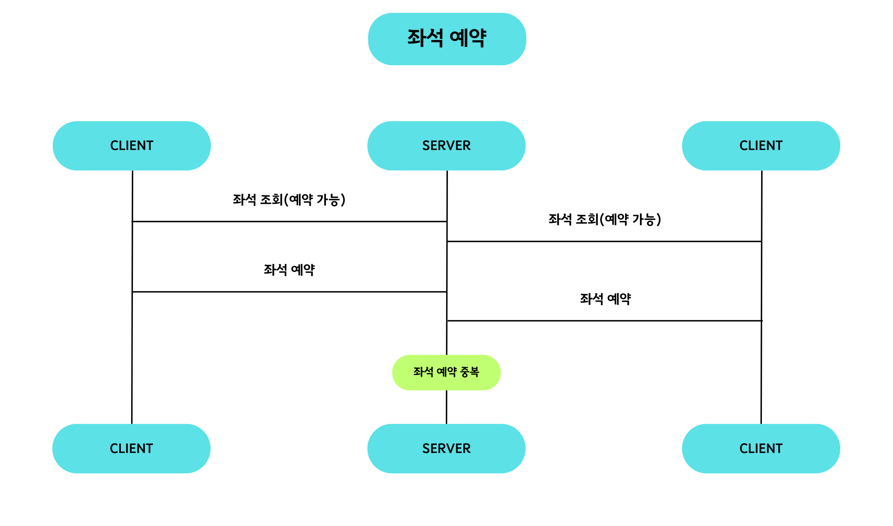
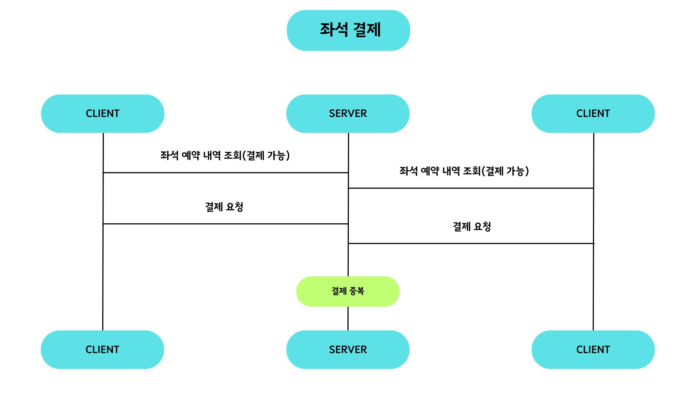
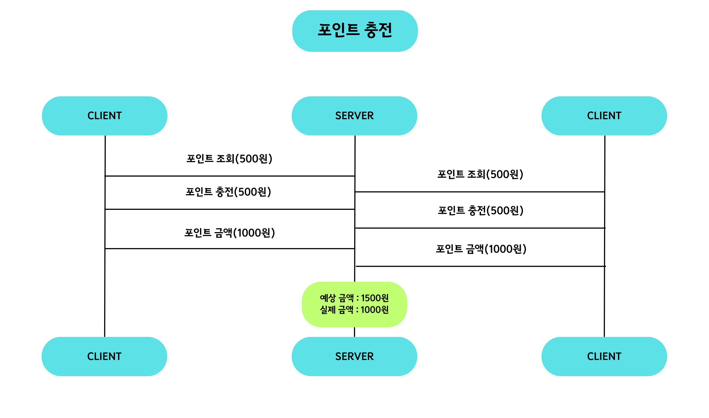
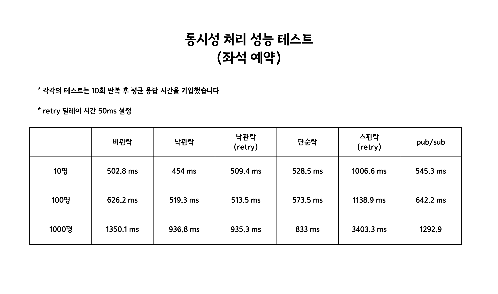
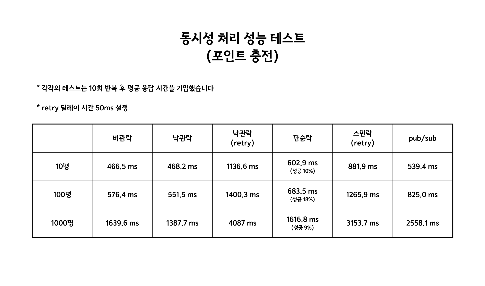

# 동시성 이슈 분석 및 해결

## 목차
1. 동시성 이슈 시나리오
2. 성능 테스트
3. 락 특징
4. 이슈 해결 시나리오

## 🔎 동시성 이슈 시나리오

### 1. 좌석 예약 

### 2. 좌석 결제

### 3. 포인트 충전

## 📈 성능 테스트
### 1. 시나리오 1 - 좌석 예약

### 1. 시나리오 2 - 포인트 충전

## 💎 락 특징

| 방식        | 특징                                                                 |
|-----------|--------------------------------------------------------------------| 
| 비관적 락     | - 데이터 일관성 : OK - 순서 보장 : OK - 충돌 가능성 높을 때: OK - DB 성능: NO |
| 낙관적 락     | - 충돌 가능성 낮을 때 : OK - 순서 보장 : NO                                 |   
| 단순 락      | - 서버 확장 고려 : OK - 구현이 간단: OK - 반응 속도 빠름: OK                  |            
| 스핀 락      | - 서버 확장 고려 : OK - CPU 자원 소모: NO - 빈번한 경합 시 성능: NO            |
| Pub/Sub 락 | - 서버 확장 고려 : OK - CPU 자원 절약: OK - 구현 복잡도: NO                 |

## 🎉 이슈 해결 시나리오

### 1️⃣ 좌석 예약 - 비관적 락

`좌석 예약 시 필요한 락을 비교해 보았을 때 가장 먼지 제외된 락은 분산락(단순락, 스핀락, pub/sub 락)이다. 이러한 분산락은 확장에 유리하지만 구현 복잡도가 높다. 하지만 확장에 여지가 없기에 가장 먼저 제거하였고 나머지 낙관적 락과 비관적 락 중 예약 요청 순서가 중요하다고 여겨 비관적 락이 적합하다고 판단하였다.`

### 1️⃣ 좌석 결제, 포인트 충전 - 낙관적 락

`좌석 결제와 포인트 충전에서 낙관적 락을 선택한 이유는, 위와 동일한 이유로 분산락을 제외시켰고 먼저 낙관적 락과 비관적 락 중 순서가 중요하지 않으며 동시성 이슈가 나타늘 확률이 낮고 비교적 속도가 빠른 낙관적락이 적합하다고 생각했다.`

