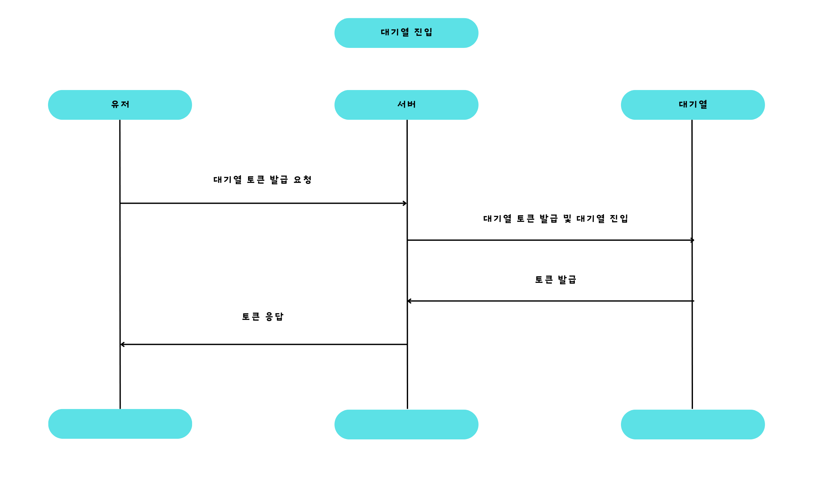

# 대기열 시스템 이관 (DB → Redis)

## **🧐 대기열이란?**

대기열이란 짧은 시간에 집중되는 트래픽을 효율적으로 관리하고 서버의 부하 분산을 위해 사용되는 시스템입니다. 콘서트 예매와 같이 특정 시점에 트래픽이 집중되는 도메인에서는 효율적인 대기열 구현이 필수적입니다. 예를 들어, 많은 사용자가 동시에 접속을 요청할 때, 대기열 시스템은 사용자를 순서대로 입장시켜 서버 부하를 방지합니다.

- 선입선출(FIFO) 방식으로 요청 처리
- 시스템 부하 조절 및 안정성 향상
- 사용자 경험 개선 (대기 상태 제공)

## 📌 현재 대기열의 문제 파악

기존 데이터베이스를 활용한 대기열 구현의 주요 문제점:

1. **서버 부하 증가**: 대기열 관리를 위한 데이터베이스 작업이 서버에 추가적인 부하를 줌
2. **성능 저하**: RDB의 특성상 빠른 데이터 추가와 상태 관리에 한계가 있음
3. **지연 발생**: 데이터베이스 트랜잭션 처리로 인한 응답 지연
4. **확장성 제한**: 대규모 트래픽 처리 시 데이터베이스 확장의 어려움

## **📋** Redis를 활용한 대기열 동작 방식

### 토큰 활성화

### 대기열 진입

### 대기 순서 확인

